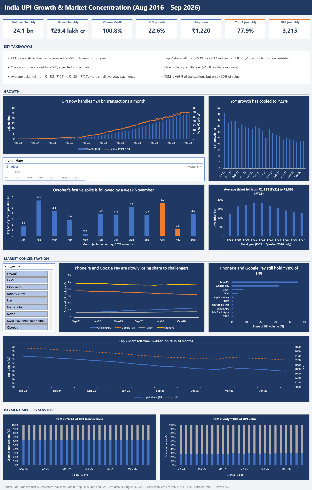
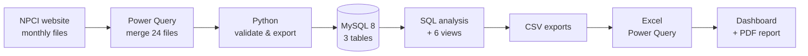

# India UPI Growth & Market Concentration Analysis (2016–2026)

I analysed **10 years of official NPCI data** (122 months, 2,052 app-level records) with Python, MySQL and Excel to answer three questions: how fast UPI is growing, how people use it, and who is winning the app market.

**The short answer:** UPI's growth rate is cooling, but it still adds ~55 bn transactions a year; payments are getting smaller; and the PhonePe–Google Pay duopoly is slowly loosening, with Navi as the fastest-rising challenger.

**Skills:** SQL (CTEs, window functions, views) · Python (pandas) data validation · MySQL data modelling · Excel (Power Query, dynamic arrays, PivotCharts) · Dashboard design · Business insights

   -1F3864)

**[📄 Insights report (PDF, 5 pages)](report/UPI_Insights_Report.pdf)** · **[📊 Excel dashboard](excel/UPI_Dashboard.xlsx)** · **[📝 All findings](findings.md)**

---

## Headline findings

1. **Growth is cooling in %, not in size.** YoY volume growth fell from 33–39% (Nov 2024 – May 2025) to **22.6%** (Sep 2026), yet UPI still adds **~55 bn transactions a year** (FY25: 54.7 bn, FY26: 55.8 bn). Since FY18, volume is up **264×** (CAGR 100.8%).
2. **Payments are getting smaller.** The average ticket fell from **₹1,838 to ₹1,301** (FY21 → FY26) while volume grew ~11×. Merchant payments are **63%** of transactions but only **30%** of value.
3. **The duopoly is loosening, slowly.** PhonePe + Google Pay hold **77.9%** (Aug 2026), down from 85.4% in Sep 2024; HHI fell from 3,757 to 3,215, still highly concentrated. **Navi** gained the most share of any app: +1.88 pp in a year (2.5% → 4.4%).

<details>
<summary><b>All 7 business questions and answers</b></summary>

| Question | Finding |
|---|---|
| How fast has UPI grown? | **264×** in 8 years: 0.9 bn (FY18) → 241.6 bn transactions (FY26), CAGR **100.8%** |
| Is growth slowing? | In %, yes: **22.6%** YoY in Sep 2026. In size, no: **~55 bn** added every year |
| Are payments getting smaller? | Average ticket **₹1,838 → ₹1,301** (FY21 → FY26), down 29% |
| How concentrated is the app market? | Top-2 share **77.9%**, HHI **3,215** (highly concentrated, but falling) |
| Who are the challengers? | **Navi** +113.9% YoY, +1.88 pp; apps outside the top 3 doubled their share, 6.2% → 13.5% |
| How is UPI used? | P2M **63.3%** of transactions, **30.0%** of value (₹577 vs ₹2,319 per payment) |
| Is there a festive effect? | It shifts spending rather than adding it: October **+5.9%** per-day growth, November **+1.3%** |

*pp = percentage points. HHI = sum of squared market shares (0–10,000); above 2,500 is highly concentrated.*
</details>

---

## Dashboard

Built in Excel: 7 KPI cards, 9 charts, an app slicer and a month timeline, all updated with one **Refresh All**.



---

## What makes this analysis different

Most UPI write-ups stop at "UPI is growing fast". These are the analytical decisions behind my numbers:

- **Separated % growth from absolute growth.** The falling YoY rate looks like a slowdown, but the yearly addition is flat at ~55 bn. That is a base effect, not weak demand.
- **Normalised for days in the month.** Sep 2026 looked like a −1.8% month; per day it was **+1.5%**. All seasonality is measured on volume per day.
- **Tested the festive effect instead of assuming it.** October (+5.9%) and November (+1.3%) together equal two ordinary months (~7.3%), so festivals mostly *move* spending into October rather than adding to it.
- **Filtered out misleading percentages.** A tiny app grew +28,971% on 0.08% share. I ranked challengers only among apps with 50 mn+ monthly transactions and compared share change in percentage points.
- **Checked my own data for bias.** NPCI listed 75 apps in Sep 2024 but 92 in Aug 2026, so up to 0.7 pp of the challengers' gain may come from new listings rather than real share gains.
- **Validated at every stage.** Python checks before loading, SQL quality checks after, row counts after every export, and totals cross-checked against [Business Standard](https://www.business-standard.com/finance/news/upi-transactions-august-2026-record-volume-npci-126090100506_1.html) and [PIB](https://www.pib.gov.in/PressReleasePage.aspx?PRID=2257087).

---

## How I built it



| Step | Code | What it does |
|---|---|---|
| **Collect** | `data/raw/upi_raw.xlsx` | Downloaded every monthly file from NPCI and merged them with Power Query into one template |
| **Validate** | [`validate_and_export.py`](python/validate_and_export.py) | Checks for duplicates, missing months, unit errors and totals, then exports clean CSVs |
| **Model** | [`01_schema.sql`](sql/01_schema.sql) · [`02_load.sql`](sql/02_load.sql) · [`03_quality_checks.sql`](sql/03_quality_checks.sql) | 3 tables with primary/foreign keys, CHECK constraints and a generated fiscal-year column |
| **Analyse** | [`04_analysis_growth.sql`](sql/04_analysis_growth.sql) · [`05_analysis_market.sql`](sql/05_analysis_market.sql) | CTEs and window functions (`LAG`, `RANK`, `ROW_NUMBER`, `SUM() OVER`, rolling `AVG`) for growth, CAGR, ticket size, seasonality, market share, HHI and rank movement |
| **Serve** | [`06_views.sql`](sql/06_views.sql) | 6 views that shape the results for Excel |
| **Visualise** | [`UPI_Dashboard.xlsx`](excel/UPI_Dashboard.xlsx) | Power Query loads the views; KPIs use `XLOOKUP`, `LET`, `FILTER`, `SORT`, `SEQUENCE`. I designed and built the dashboard: 7 KPI cards, 9 charts, an app slicer and a month timeline, all updated with one **Refresh All** |

<details>
<summary><b>Example query: top-2 share, top-5 share and HHI per month</b></summary>

```sql
CREATE OR REPLACE VIEW vw_concentration AS
WITH s AS (
    SELECT a.month_date,
           100 * a.volume_mn / m.volume_mn AS share_pct,
           ROW_NUMBER() OVER (PARTITION BY a.month_date ORDER BY a.volume_mn DESC) AS rn
    FROM upi_apps a
    JOIN upi_monthly m USING (month_date)
)
SELECT month_date,
       ROUND(SUM(CASE WHEN rn <= 2 THEN share_pct END), 1) AS top2_share_pct,
       ROUND(SUM(CASE WHEN rn <= 5 THEN share_pct END), 1) AS top5_share_pct,
       ROUND(SUM(share_pct * share_pct), 0)                AS hhi
FROM s
GROUP BY month_date;
```
</details>

---

## More details

<details>
<summary><b>Recommendations</b></summary>

| Who | What | Why |
|---|---|---|
| Payment apps and merchant acquirers | Compete on the speed and reliability of small payments (for example UPI Lite and sound boxes) | The average ticket is falling and merchant payments are 63% of transactions: that is where the volume is |
| RBI and NPCI | Track top-2 share and HHI every month | Concentration is falling, but an HHI of 3,215 is still highly concentrated |
| Challenger apps | Measure repeat usage, not just volume | Google Pay's lost share spread across many apps; whoever keeps users will keep the share |
</details>

<details>
<summary><b>Data and sources</b></summary>

| Dataset | Period | Rows |
|---|---|---|
| Monthly UPI totals (volume, value, banks live) | Aug 2016 – Sep 2026 | 122 |
| App-wise volume and value | Sep 2024 – Aug 2026 | 2,052 |
| P2P vs P2M split | Sep 2024 – Aug 2026 | 48 |

- **Source:** [NPCI UPI statistics](https://www.npci.org.in/product/ecosystem-statistics/upi).
- **Units:** raw data in million transactions and ₹ crore; results shown in billions (bn) and ₹ lakh crore.
- **Fiscal year:** April to March. FY17 and FY27 are partial, so growth and CAGR use complete years only (FY18–FY26).
</details>

<details>
<summary><b>Debugging challenges I solved</b></summary>

| Problem | Fix |
|---|---|
| MySQL's `RANK()` returns an unsigned integer, so subtracting ranks for apps that fell (6 → 10) threw an out-of-range error | `CAST(... AS SIGNED)` before subtracting |
| MySQL Workbench's default "Limit to 1000 rows" silently cut an export to 1,000 of 2,052 rows | Caught with a `COUNT(*)` check; I now verify row counts after every export |
| Connecting the app slicer to the Top-10 pivot silently removed the Top-10 filter | Enabled "Allow multiple filters per field" in PivotTable options |
</details>

<details>
<summary><b>Repository structure</b></summary>

```
upi-growth-analysis/
├── data/
│   ├── raw/        upi_raw.xlsx: NPCI data merged into a fixed template
│   ├── clean/      validated CSVs (Python output)
│   └── views/      6 SQL view exports used by Excel
├── python/         validate_and_export.py
├── sql/            01_schema → 02_load → 03_quality_checks → 04_analysis_growth → 05_analysis_market → 06_views
├── excel/          UPI_Dashboard.xlsx
├── report/         UPI_Insights_Report.pdf
├── images/         dashboard.png
├── findings.md     all findings, insights, limitations and sources
└── README.md
```
</details>

<details>
<summary><b>How to reproduce</b></summary>

1. **Validate and export the data.** `data/raw/upi_raw.xlsx` is included (to rebuild it, download the monthly files from NPCI and merge them with Power Query).
   ```bash
   pip install pandas openpyxl
   python python/validate_and_export.py
   ```
2. **Build the database.** In MySQL 8, run `sql/01_schema.sql`, then `sql/02_load.sql` (edit the CSV paths first; `LOAD DATA LOCAL INFILE` needs `local_infile` enabled), then `03` to `06` in order.
3. **Export the views.** Export each of the six views to `data/views/<view>.csv`, keeping the names unchanged. In MySQL Workbench, set the row limit to **Don't Limit** first (`vw_app_share` has 2,052 rows).
4. **Refresh the dashboard.** Open `excel/UPI_Dashboard.xlsx`, update the file path in each query's Source step if your folder differs, then click **Data → Refresh All**.
</details>

<details>
<summary><b>Limitations and future work</b></summary>

**Limitations**
- Data was collected manually from NPCI and validated; NPCI may revise figures later.
- App-wise data is released about a month after the monthly totals (latest app month: Aug 2026).
- App data covers only the apps NPCI lists (97.5–99.4% of volume per month), so top-2 share and HHI are very slightly understated.
- Average ticket is value ÷ volume, so a change in the P2P/P2M mix also moves it.
- Seasonality averages only 5–6 years per month, and 2021 includes COVID lockdown months.

**Future work:** state-wise and merchant-category analysis · a Power BI version of the dashboard · a simple 12-month volume forecast
</details>

---

## How I worked (and where AI helped)

**What I did:** downloaded every monthly file from NPCI and merged them with Power Query, validated the data in Python, built the MySQL tables, ran and debugged every query, exported the views, built the Excel model, and designed and built the dashboard. I checked every number against my SQL output.

**Where AI helped:** I used AI (Claude) like a mentor and reviewer: to plan the project, explain errors when I got stuck, guide me in areas I was less confident in, and cross-check each day's work. I also used it to turn my findings into polished documents (findings.md, this README and the PDF report) and for a final polish of the dashboard layout.

Every number in this project comes from my own SQL on NPCI data.

## About me

**Aryan** · B.Tech CSE (2025) · Open to **Data Analyst** and **MIS** roles

[LinkedIn](https://www.linkedin.com/in/faustus-aryan-b71978224) · [Email](mailto:aryanaryan7908@gmail.com) · [GitHub](https://github.com/faustusaryan)

<sub>Data: © NPCI, used here for non-commercial analysis.</sub>
