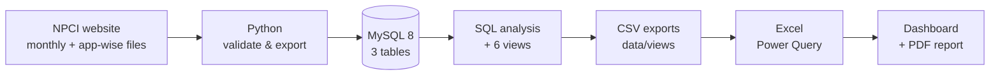

# India UPI Growth & Market Concentration Analysis (2016–2026)

How fast has UPI grown, how are people using it, and who is winning the app market? An end-to-end analysis of 10 years of official NPCI data, from raw files to a validated MySQL model, an interactive Excel dashboard and a 5-page insights report.

**Skills:** SQL (CTEs, window functions, views) · Data validation (Python, pandas) · Data modelling (MySQL) · Excel (Power Query, dynamic arrays, PivotCharts) · Dashboard design · Business insights


-1F3864)

**[📄 Insights report (PDF)](report/UPI_Insights_Report.pdf)** · **[📊 Excel dashboard](excel/UPI_Dashboard.xlsx)** · **[📝 Full findings](findings.md)**


---

## Key findings

| Question | Finding |
|---|---|
| How fast has UPI grown? | **264×** in 8 years: 0.9 bn (FY18) → 241.6 bn transactions (FY26), a CAGR of **100.8%** |
| Is growth slowing? | In %, yes: YoY fell from 33–39% to **22.6%** (Sep 2026). In size, no: UPI still adds **~55 bn** transactions a year |
| Are payments getting smaller? | Average ticket **₹1,838 → ₹1,301** (FY21 → FY26), down 29%, while volume grew ~11× |
| How concentrated is the app market? | PhonePe + Google Pay hold **77.9%** (Aug 2026), down from 85.4% in Sep 2024; HHI **3,215**, still highly concentrated |
| Who are the challengers? | **Navi**: +113.9% YoY and +1.88 pp share (2.5% → 4.4%). Apps outside the top 3 doubled their share, 6.2% → 13.5% |
| How is UPI used? | Payments to merchants (P2M) are **63.3%** of transactions but only **30.0%** of value (₹577 vs ₹2,319 per payment) |
| Is there a festive effect? | It shifts spending rather than adding it: October **+5.9%** per-day growth, November **+1.3%** |

*pp = percentage points. HHI = sum of squared market shares (0–10,000); above 2,500 counts as highly concentrated.*

## Recommendations

- **Payment apps and merchant acquirers:** compete on the speed and reliability of small payments (for example UPI Lite and sound boxes). The average ticket is falling and P2M is 63% of transactions, so that is where the volume is.
- **RBI and NPCI:** track top-2 share and HHI every month. Concentration is falling, but 3,215 is still highly concentrated.
- **Challenger apps:** measure repeat usage, not just volume. Google Pay's lost share spread across many apps; whoever keeps users will keep the share.

---

## Data

| Dataset | Period | Rows |
|---|---|---|
| Monthly UPI totals (volume, value, banks live) | Aug 2016 – Sep 2026 | 122 |
| App-wise volume and value | Sep 2024 – Aug 2026 | 2,052 |
| P2P vs P2M split | Sep 2024 – Aug 2026 | 48 |

- **Source:** [NPCI UPI statistics](https://www.npci.org.in/product/ecosystem-statistics/upi). App-wise and P2P/P2M data come from 24 monthly files, combined into one template.
- **Units:** raw data is in million transactions and ₹ crore; results are shown in billions (bn) and ₹ lakh crore.
- **Fiscal year:** April to March. FY17 and FY27 are partial, so growth and CAGR use complete years only (FY18–FY26).
- **Cross-checks:** Jul and Aug 2026 totals match [Business Standard](https://www.business-standard.com/finance/news/upi-transactions-august-2026-record-volume-npci-126090100506_1.html); the P2M share matches [PIB](https://www.pib.gov.in/PressReleasePage.aspx?PRID=2257087).

---

## How I built it



| Step | Tool | What it does |
|---|---|---|
| 1. Validate | Python (pandas) | `validate_and_export.py` checks the raw template for duplicates, missing months, unit errors and totals, then exports clean CSVs |
| 2. Model | MySQL 8 | 3 tables (`upi_monthly`, `upi_apps`, `upi_p2p_p2m`) with primary/foreign keys, CHECK constraints and a generated fiscal-year column; SQL quality checks |
| 3. Analyse | MySQL 8 | CTEs and window functions (`LAG`, `RANK`, `ROW_NUMBER`, `SUM() OVER`, rolling `AVG`) for growth, CAGR, YoY, ticket size, seasonality, market share, HHI and rank movement |
| 4. Serve | MySQL views | 6 views shape the results for Excel: monthly trend, FY summary, app share, concentration, P2P/P2M, seasonality |
| 5. Visualise | Excel | Power Query loads the 6 view exports; KPIs use `XLOOKUP`, `LET`, `FILTER`, `SORT`, `SEQUENCE`; dashboard with 7 KPI cards, 9 charts, an app slicer and a month timeline; **Data → Refresh All** updates everything |

<details>
<summary><b>Example query: top-2 share, top-5 share and HHI per month</b></summary>

```sql
CREATE OR REPLACE VIEW vw_concentration AS
WITH s AS (
    SELECT a.month_date,
           100 * a.volume_mn / m.volume_mn AS share_pct,
           ROW_NUMBER() OVER (PARTITION BY a.month_date ORDER BY a.volume_mn DESC) AS rn
    FROM upi_apps a
    JOIN upi_monthly m USING (month_date)
)
SELECT month_date,
       ROUND(SUM(CASE WHEN rn <= 2 THEN share_pct END), 1) AS top2_share_pct,
       ROUND(SUM(CASE WHEN rn <= 5 THEN share_pct END), 1) AS top5_share_pct,
       ROUND(SUM(share_pct * share_pct), 0)                AS hhi
FROM s
GROUP BY month_date;
```
</details>

---

## Challenges and what I learned

| Problem | What I did |
|---|---|
| MySQL's `RANK()` returns an unsigned integer, so subtracting ranks for apps that fell (6 → 10) threw an out-of-range error | Cast both ranks with `CAST(... AS SIGNED)` before subtracting |
| MySQL Workbench's default "Limit to 1000 rows" silently cut an export to 1,000 of 2,052 rows | Caught it with a `COUNT(*)` check; now I verify row counts after every export |
| Tiny apps showed growth like +28,971% on almost no volume | Ranked challengers only among apps with 50 mn+ monthly transactions and compared share change in pp |
| Sep 2026 looked like a −1.8% month, but September has 30 days and August 31 | Measured seasonality on volume per day; per day, Sep 2026 was up 1.5% |
| Connecting the app slicer to the Top-10 pivot silently removed the Top-10 filter | Enabled "Allow multiple filters per field" in PivotTable options |
| NPCI listed 75 apps in Sep 2024 but 92 in Aug 2026 | Flagged that up to 0.7 pp of the challengers' gain may come from new listings, not real share gains |

---

## Repository structure

```
upi-growth-analysis/
├── data/
│   ├── raw/        upi_raw.xlsx: NPCI data in a fixed template
│   ├── clean/      validated CSVs (Python output)
│   └── views/      6 SQL view exports used by Excel
├── python/         validate_and_export.py
├── sql/            01_schema → 02_load → 03_quality_checks → 04_analysis_growth → 05_analysis_market → 06_views
├── excel/          UPI_Dashboard.xlsx
├── report/         UPI_Insights_Report.pdf
├── images/         dashboard.png
├── findings.md     all findings, insights, limitations and sources
└── README.md
```

## How to reproduce

<details>
<summary><b>Step-by-step</b></summary>

1. **Validate and export the data**
   ```bash
   pip install pandas openpyxl
   python python/validate_and_export.py
   ```
2. **Build the database.** In MySQL 8, run `sql/01_schema.sql`, then `sql/02_load.sql` (edit the CSV file paths first; `LOAD DATA LOCAL INFILE` needs `local_infile` enabled), then `03` to `06` in order.
3. **Export the views.** Run `SELECT * FROM <view>` for each of the six views and export to `data/views/<view>.csv`, keeping the file names unchanged. In MySQL Workbench, set the row limit to **Don't Limit** first (`vw_app_share` has 2,052 rows).
4. **Refresh the dashboard.** Open `excel/UPI_Dashboard.xlsx`, update the file path in each query's Source step if your folder differs, then click **Data → Refresh All**.

</details>

---

## Limitations

- Data was collected manually from NPCI and validated; NPCI may revise figures later.
- App-wise data is released about a month after the monthly totals (latest app month: Aug 2026).
- App data covers only the apps NPCI lists (97.5–99.4% of volume per month), so top-2 share and HHI are very slightly understated.
- Average ticket is value ÷ volume, so a change in the P2P/P2M mix also moves it.
- Seasonality averages only 5–6 years per month, and 2021 includes COVID lockdown months.

## Future work

State-wise and merchant-category analysis · A Power BI version of the dashboard · A simple 12-month volume forecast

## How I used AI

I used AI (Claude) as a reviewer and assistant: debugging SQL and Excel errors, double-checking numbers, and improving the dashboard layout and writing. The data collection, SQL, Excel model and findings are my own, and every number comes from my SQL on NPCI data.

---

## About me

**Aryan** · B.Tech CSE (2025) · Open to **Data Analyst** and **MIS** roles

[LinkedIn](https://www.linkedin.com/in/faustus-aryan-b71978224) · [Email](mailto:aryanaryan7908@gmail.com) · [GitHub](https://github.com/faustusaryan)

*Data: © NPCI, used here for non-commercial analysis.*
